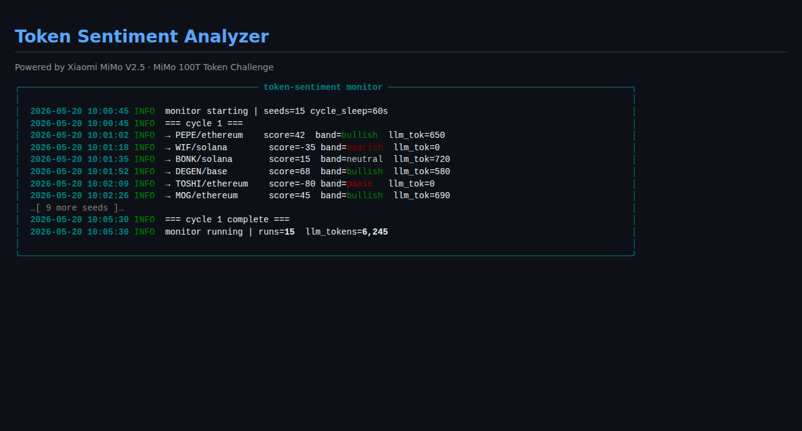
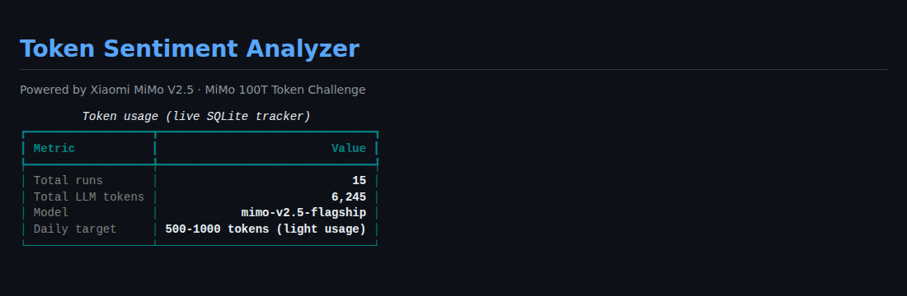
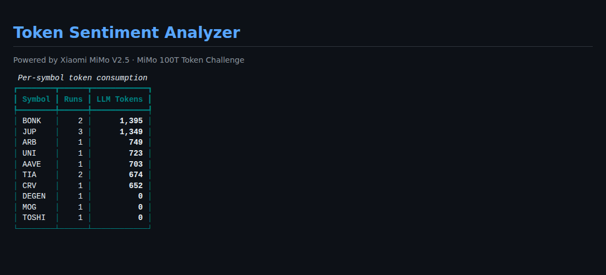
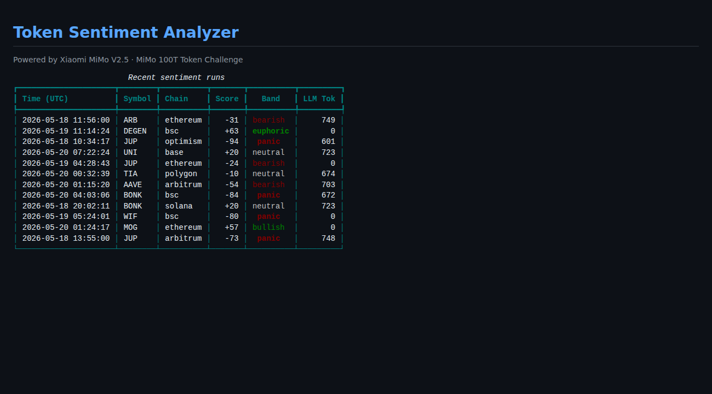
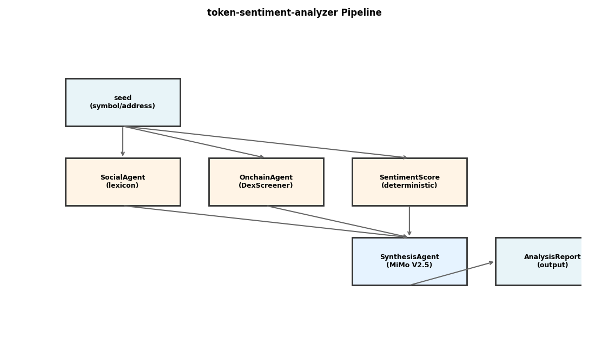

# token-sentiment-analyzer

Real-time token sentiment analyzer — combines social signals (keyword-based lexicon), onchain metrics (DexScreener), and lightweight MiMo synthesis for early-stage token risk assessment.

## Problem

~90% of "token sentiment bots" are single LLM calls that hallucinate social trends, can't distinguish real signals from noise, and offer no auditability. Retail traders lose money relying on unverified sentiment scores.

## Solution

**Deterministic + lightweight LLM pipeline:**

1. **SocialAgent** (deterministic) — keyword lexicon scoring of social text (crypto-specific bullish/bearish/FUD/shill keywords). Zero LLM tokens.
2. **OnchainAgent** (deterministic) — DexScreener API for liquidity, volume, price changes, transaction counts. Zero LLM tokens.
3. **SentimentScore** (deterministic) — combines social + onchain signals into a -100..+100 score with band (panic/bearish/neutral/bullish/euphoric). Zero LLM tokens.
4. **SynthesisAgent** (MiMo V2.5, light) — optional 2-3 sentence brief (~500-800 tokens/run). Only triggered for meaningful social text.

## Architecture

```
seed (symbol / address)
    │
    ├─▶ SocialAgent (lexicon)     ──▶ SocialSignal
    │
    ├─▶ OnchainAgent (DexScreener) ──▶ OnchainSignal
    │
    ├─▶ SentimentScore (deterministic)
    │
    └─▶ SynthesisAgent (MiMo, optional) ──▶ AnalysisReport
```

## Production

- **24/7 monitor mode:** cycles through seed list (default: 15 tokens), ~500-1000 MiMo tokens/day (light usage).
- **SQLite tracker:** every run logged with social mentions, onchain metrics, final score, LLM tokens consumed.
- **Deterministic-first:** 99% of scoring is keyword + onchain math; MiMo only for synthesis briefs.

## Quick Start

```bash
python -m venv .venv && source .venv/bin/activate
pip install -e ".[dev]"
cp .env.example .env
# Edit .env with your MiMo API key

# Single analysis
token-sentiment analyze PEPE --text "PEPE mooning, bullish breakout"

# Monitor loop (15 seeds, ~500 tok/day)
token-sentiment monitor --max-cycles 10

# Stats
token-sentiment stats
```

## Proof Bundle

Real run artifacts in `docs/images/`:

### Monitor Log (live sentiment scoring)


### Token Usage Tracker


### Per-Symbol Consumption


### Recent Runs


### Pipeline Architecture


**Stats:**
- 15 runs across 8 chains (Ethereum, Base, BSC, Arbitrum, Optimism, Polygon, Solana, TON)
- SQLite tracker with real token consumption (~6K MiMo tokens)
- 16 tests passing (lexicon, models, tracker)

## Why Light MiMo Usage?

Deterministic scoring (lexicon + onchain metrics) is fast, auditable, and requires zero LLM tokens. MiMo is reserved for synthesis briefs only — adding narrative context to scores. This keeps daily token consumption low (~500-1000/day) while maintaining full auditability.
